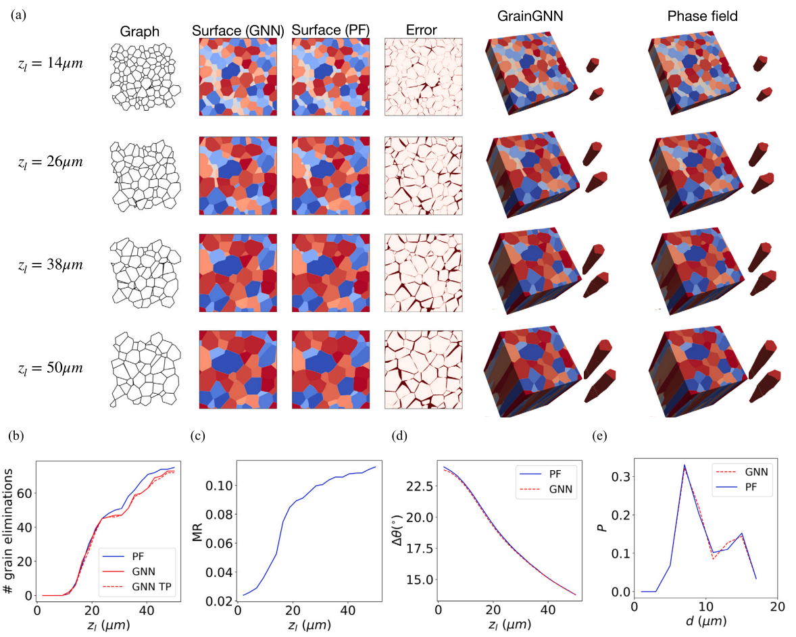
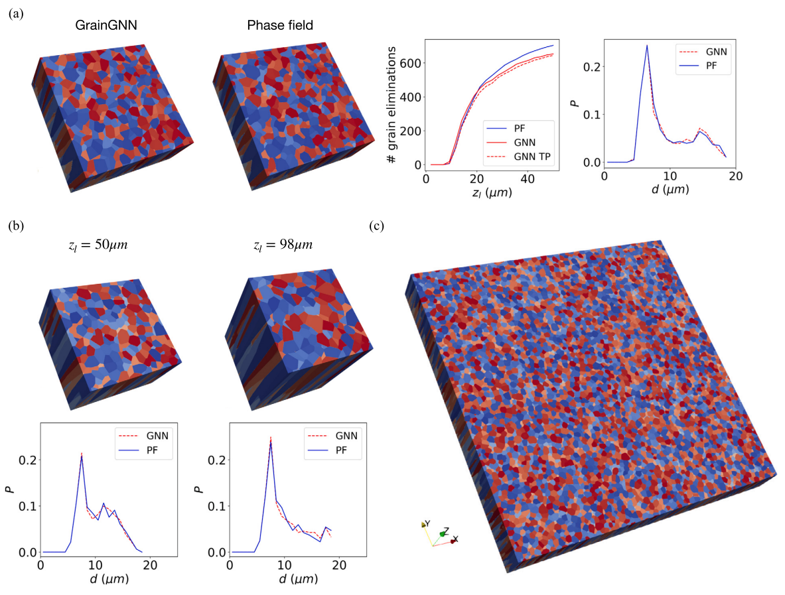

# GrainGNN: A dynamic heterogeneous graph neural network for large-scale 3D grain microstructure evolution.
GrainGNN is a GNN surrogate model for predicting grain microstructure under additive manufacturing conditions. Paper: https://www.sciencedirect.com/science/article/pii/S0021999124003103
## Cite

If you are using the codes in this repository, please cite the paper
```
@article{qin2024graingnn,
  title={GrainGNN: A dynamic graph neural network for predicting 3D grain microstructure},
  author={Qin, Yigong and DeWitt, Stephen and Radhakrishnan, Balasubramaniam and Biros, George},
  journal={Journal of Computational Physics},
  volume={510},
  pages={113061},
  year={2024},
  publisher={Elsevier}
}
```

## Build
use the local CUDA version

CUDA 10
```sh
export TORCH=1.11.0+cu102
export CUDA=cu102
```
CUDA 11
```sh
export TORCH=1.12.0+cu113
export CUDA=cu113
```

```sh
pip3 install torch==${TORCH} --extra-index-url https://download.pytorch.org/whl/${CUDA}
pip3 install -r requirements.txt
```

## Reproduce paper results
The trained models, including the regressor and classifier, are provided in the folder model/   
In the paper, the trained models are validated by comparing the predicted 3D field data with the high-fidelity data. We choose a phase field (PF) solver as the method to generate high-fidelity data. The codes can be found here https://github.com/YigongQin/cuPF. Under the folder rawdat_PF/, we provide two compressed PF data. One is of domain size 40umX40umX50um, and the other is of domain size 120umX120umX50um. To compare the GrainGNN results and PF results, and reproduce the results reported in the paper, follow the steps below.

### Steps
For the domain size of 40umX40umX50um:
1. **Decompress the phase field data to .h5 file**
   ```sh
   gzip -d rawdat_PF/40_40/Epita_grains118_nodes236_frames120_G1.904_Rmax0.558_seed10020_Mt36920_train0_test1_rank0.h5.gz
   ```
2. **Extract phase field data and create the graph for t=0**
   specify the seed number and domain size (--lxd)
   ```sh
   python3 graph_trajectory.py --mode=test --rawdat_dir=./rawdat_PF/40_40/ --seed=10020 --lxd=40 --save_dir=./graphs/40_40/
   ```
   After this step, you should get the files seed10020_G1.904_R0.558_span6.pkl and traj10020.pkl in graphs/40_40/. You can verify them with the files given in the repo.
3. **Evolve the graph and get image results**
   specify the folder of graph data (--truth_dir) and seed number
   ```sh
   python3 test.py --truth_dir=./graphs/40_40/ --seed=10020
   ```
   After this step, you should get the plots for quantities of interest (QoIs) and image comparison for the last layer of grain structure. Compare the generated images with the Fig.8 of the paper


Similarly for the domain of 120umX120umX50um:
```sh
gzip -d rawdat_PF/120_120/Epita_grains1043_nodes2086_frames120_lxd120.000008_G10.000_Rmax2.000_UC20.000_seed0_Mt10300_rank0.h5.gz
python3 graph_trajectory.py --mode=test --rawdat_dir=./rawdat_PF/120_120/ --seed=0 --lxd=120 --save_dir=./graphs/120_120/
python3 test.py --truth_dir=./graphs/120_120/ --seed=0
```
Results correspond to Fig.11(a) of the paper

### Numbers to check


## Inference the models only
The accuracy of the model under various thermal and grain configurations is discussed in the paper. If you are interested in the same material -- stainless steel 316L, and a similar range of thermal conditions, you can choose to run GrainGNN inference without having the high-fidelity data:


## Train your models with the same phase field data
The full training dataset is large. We are figuring out ways to share the raw data and the extracted graphs. Examples of training commands once having the training dataset:
```
python3 train.py --model_type=regressor --model_id=0 --device=cuda
python3 train.py --model_type=classifier --model_id=1 --device=cuda
```


